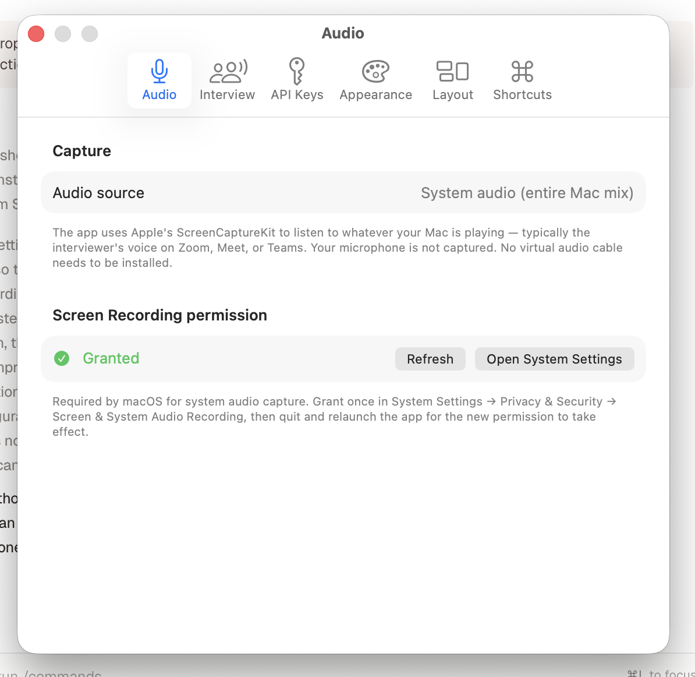
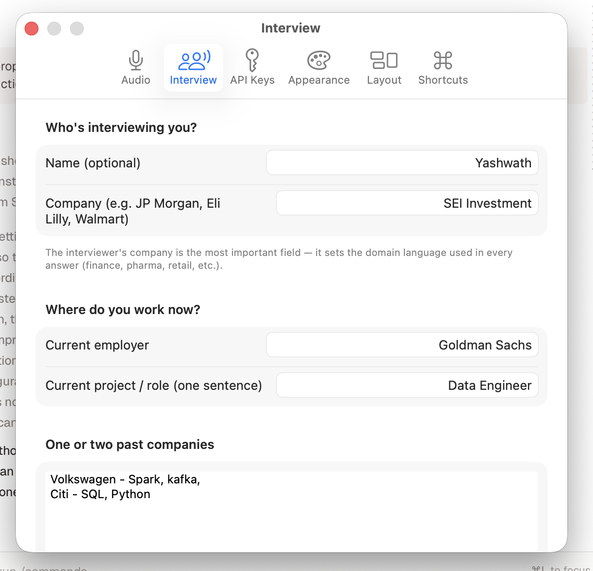
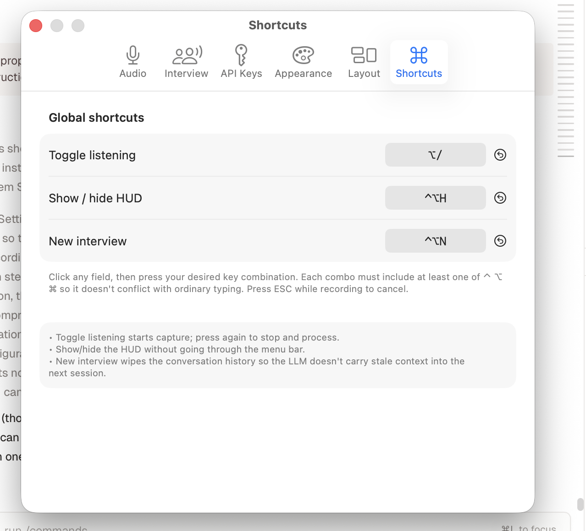
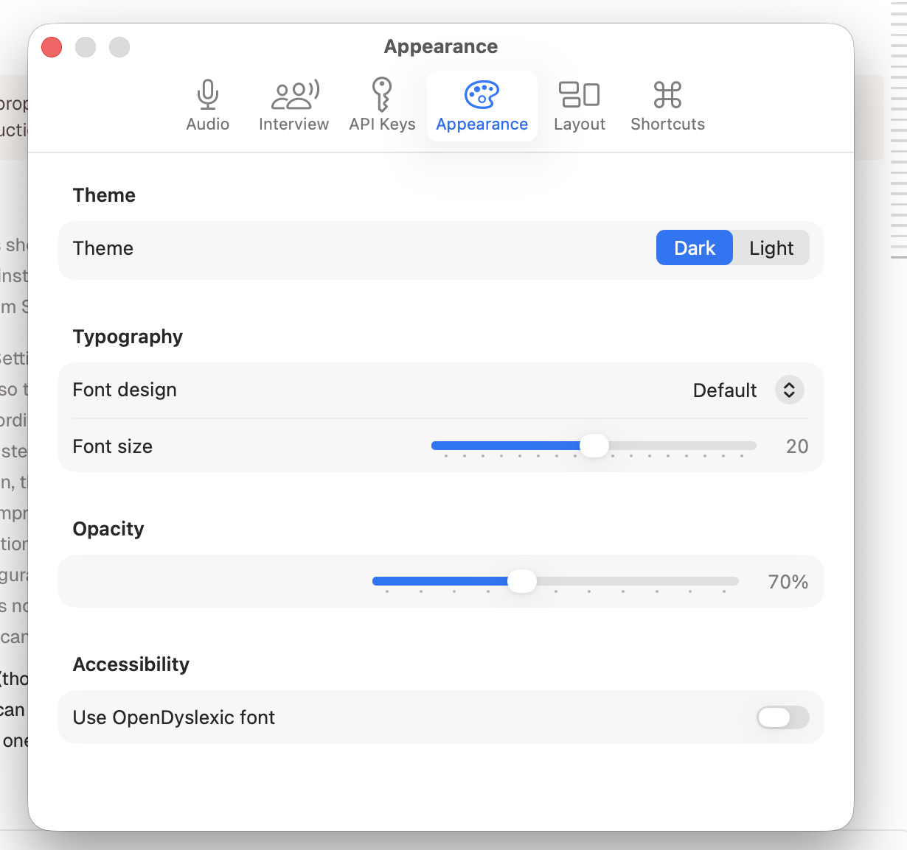
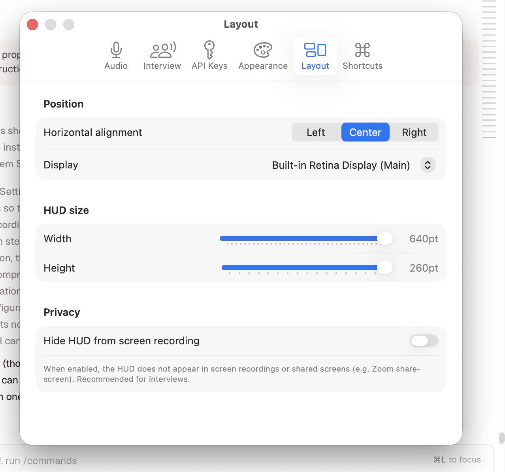

# AiLA — Team Install Guide

Step-by-step setup for new team members. Takes about 90 seconds end-to-end if everything goes smoothly. About 3 minutes if you hit the relaunch gotcha.

**Requirements:** macOS Sonoma (14.x) or later. M-series Mac with a notch is ideal but any Mac works.

---

## Step 1 — Get the app from Slack

1. In the team Slack channel, find the latest message titled **"AiLA team build — vYYYY-MM-DD"** (or similar).
2. Download the attached file. The filename looks like `NotchPrompter-team-20260503-2120.zip`.
3. Find the download in your `~/Downloads` folder.

> 📸 *Screenshot slot 1 — Slack message with the .zip attachment.*

---

## Step 2 — Install the app

1. Double-click the `.zip` file in `~/Downloads`. macOS will unzip it in place, leaving a `notch-prompter.app` next to the zip.
2. Open a Finder window. In the sidebar, click **Applications**.
3. Drag `notch-prompter.app` from `~/Downloads` into the **Applications** folder.
4. You can delete the original `.zip` if you want — it's not needed anymore.

> 📸 *Screenshot slot 2 — Finder showing the .app being dragged into /Applications.*

---

## Step 3 — Open the app for the first time (Gatekeeper warning)

The first time you double-click `notch-prompter.app`, macOS will show a warning like:

> **"notch-prompter" cannot be opened because Apple cannot check it for malicious software.**

This is expected — the app is signed by the team, not Apple's notarization service, so Gatekeeper shows a warning. To open it the first time:

1. In the **Applications** folder, **right-click** `notch-prompter` (or hold **Control** and click).
2. From the context menu, choose **Open**.
3. A new dialog appears with the same warning text, but now there's an extra button: **Open**. Click it.

> 📸 *Screenshot slot 3 — the right-click context menu showing the "Open" item highlighted.*
>
> 📸 *Screenshot slot 4 — the dialog showing the "Open" button (not just "OK").*

After this, the app launches and you'll never see this warning again on your Mac for this app.

You should see a small **AiLA / notch-prompter icon appear in the macOS menu bar** (top-right corner of the screen, near the clock and battery icon).

> 📸 *Screenshot slot 5 — the menu bar showing the AiLA icon.*

---

## Step 4 — Grant Screen Recording permission

This is the **most important step**. The app needs Screen Recording permission to listen to system audio (so it can hear the interviewer through Zoom / Meet / Teams). You only have to do this once.

### 4a. Open Settings

1. Click the AiLA icon in the menu bar.
2. From the dropdown, choose **Settings…** (or press ⌘,).
3. The Settings window opens. Click the **Audio** tab.

> 📸 *Screenshot slot 6 — the menu bar dropdown with "Settings…" highlighted.*

### 4b. Trigger the permission prompt

Inside the **Audio** tab you'll see a section titled **Screen Recording permission**. Right now it'll say **"Not granted"** in orange.

1. Click the **Open System Settings** button next to it.
2. macOS opens **System Settings → Privacy & Security → Screen & System Audio Recording**.

> 📸 *Screenshot slot 7 — the Settings → Audio tab showing the orange "Not granted" status and the "Open System Settings" button.*

### 4c. Enable the toggle

In **System Settings → Privacy & Security → Screen & System Audio Recording**, you'll see a list of apps with toggles on the right.

1. Scroll the list until you find **notch-prompter** (or **AiLA** — same app, different display label depending on build).
2. Click the toggle on the right of that row. It should turn **blue** to indicate ON.
3. macOS will ask you to authenticate with **Touch ID, Face ID, or your password** before applying the change. Authenticate.

> 📸 *Screenshot slot 8 — System Settings showing the "Screen & System Audio Recording" list, with the notch-prompter row highlighted.*
>
> 📸 *Screenshot slot 9 — the toggle in the ON (blue) state next to notch-prompter.*

### 4d. **Quit and relaunch the app** (don't skip this)

This is the step everyone forgets. macOS does **not** apply the new Screen Recording permission to an already-running app. You **must quit the app fully and reopen it**.

1. Click the AiLA icon in the menu bar.
2. From the dropdown, choose **Exit** (or press ⌘Q while AiLA is the active app).
3. Wait two seconds.
4. Double-click `notch-prompter` in `/Applications` to open it again. (No right-click needed this time.)

> 📸 *Screenshot slot 10 — the AiLA dropdown menu showing the "Exit" option.*

### 4e. Verify permission is now granted

1. Click the AiLA menu bar icon → **Settings…**
2. Click the **Audio** tab.
3. The **Screen Recording permission** section should now say **"Granted"** in **green** with a checkmark.



If it still says **"Not granted"** after relaunching, see [Troubleshooting](#troubleshooting-screen-recording-permission) below.

---

## Step 5 — Fill in your interview setup

1. In Settings, click the **Interview** tab.
2. Fill in (in this order):
   - **Interviewer name** — optional but recommended (the human you're meeting)
   - **Company** — the **most important field**. The interviewer's company shapes the language the AI uses in every answer. e.g. "JP Morgan", "Eli Lilly", "Walmart", "Stripe"
   - **Current employer** — where you work right now
   - **Current project / role** — one sentence, e.g. "lead engineer on the trade reconciliation pipeline"
   - **Past companies** — one per line, format `CompanyName — what you did there`. Two is enough.
3. When you've filled at least Company + Current Employer, a green ✓ **"Setup complete — ready for the interview."** appears at the bottom.



---

## Step 6 — Verify shortcuts

1. In Settings, click the **Shortcuts** tab.
2. Confirm you see three global shortcuts:
   - **Toggle listening** — default `⌃⌥?` (Control + Option + Shift + `/`)
   - **Show / hide HUD** — default `⌃⌥H`
   - **New interview** — default `⌃⌥N`
3. Click any shortcut field if you want to record your own custom combo.



---

## Step 7 — Run a smoke test

Before your real interview, test the full pipeline once:

1. Find any **tech interview question YouTube video** (there are dozens — search "system design interview question").
2. Start playing it.
3. When the interviewer in the video asks a question, press **⌃⌥?**.
4. You'll see a red pulsing dot in the notch — that's the **Listening** state.
5. Let the interviewer in the video finish their question (5-15 seconds).
6. Press **⌃⌥?** again.
7. The notch will show a **bridge phrase** (a short sentence you can read aloud while the main answer is being prepared, like "On the orchestration question, our approach at JP Morgan involved a specific pattern.").
8. Within ~1-2 seconds, the bridge fades and the **full structured answer** appears:
   - A bold **lead** sentence at the top
   - **▸ beats** — short bullet anchors of the story
   - **— closer** in italic at the bottom
   - **↳ runway** — likely follow-up topics

> 📸 *Screenshot slot 14 — the notch HUD showing a complete structured answer.*

If you see all of that, you're done. If you see "No speech detected" or "Error", see [Troubleshooting](#troubleshooting-no-speech-detected) below.

---

## Step 8 — Hide the HUD between interviews

Press **⌃⌥H** at any time to hide / show the notch HUD. Press **⌃⌥N** to clear the conversation history before starting a new interview (so the AI doesn't carry over context from the previous one).

---

# Optional: tune the look and feel

These are nice-to-have customizations. Defaults are fine for most people; come back here if you want to adjust.

## Appearance

**Settings → Appearance** lets you switch the HUD theme (dark / light), pick a font family, scale the font size, adjust opacity, and turn on **OpenDyslexic** — a bundled font designed to reduce letter confusion. Toggle it on if the default system font is hard to read at a glance.



## Layout

**Settings → Layout** controls where the HUD appears on screen. Multi-monitor users should pick the **Display** that matches their interview camera setup — typically your built-in laptop screen. Width and height sliders adjust the HUD's bounding box; the defaults (640pt × 260pt) fit most answers comfortably.

> ⚠️ **Privacy toggle.** The **Hide HUD from screen recording** toggle should normally be **ON** for live interviews. When ON, the HUD is invisible to Zoom screen-share, QuickTime recordings, and similar capture tools. Turn it OFF only if you're recording a demo of AiLA itself.



---

# Troubleshooting

## Troubleshooting: Screen Recording permission

### Symptom: I granted permission and relaunched, but the app still says "Not granted"

macOS sometimes gets confused with apps that have been rebuilt or downloaded multiple times. The fix is to reset the permission cache:

```bash
# In Terminal, paste these one at a time:
tccutil reset ScreenCapture com.notchprompter.app
tccutil reset All com.notchprompter.app
```

Then:

1. Quit AiLA fully (menu bar → Exit, or ⌘Q while focused).
2. Open System Settings → Privacy & Security → Screen & System Audio Recording.
3. If you see any **notch-prompter** entry, click the **(−) minus** button to remove it entirely.
4. Quit System Settings.
5. Relaunch AiLA. The permission prompt should re-appear fresh.
6. Grant permission, quit AiLA, relaunch one more time.
7. Check Settings → Audio. Should show **Granted (green)**.

### Symptom: I don't see any permission prompt when I trigger the hotkey

You may have previously denied the permission. Use the reset commands above, then try again.

## Troubleshooting: "No speech detected"

The app captures audio successfully but ElevenLabs couldn't find any speech. Common causes:

1. **The audio was your microphone, not the system output.** AiLA does NOT capture your microphone — it only captures the system audio mix (what's playing through your speakers). To test: play any YouTube video and trigger the hotkey while the video is playing. If that works but your voice doesn't, this is expected behavior.

2. **Your output is muted or routed to headphones that aren't playing.** Make sure audio is actually playing through your default output device. The volume bar in the menu bar should be active.

3. **You triggered the hotkey for too short.** If you press the hotkey twice within a second, the audio sample is too short to transcribe. Hold the question for at least 2-3 seconds of speech.

## Troubleshooting: Hotkey not responding

1. Open Settings → Shortcuts. Make sure the **Toggle listening** field is not empty.
2. Try clicking the field and pressing a different combo. Some keyboards send unusual codes for combos with Shift+/.
3. If still nothing happens: quit AiLA, relaunch, try again.

## Troubleshooting: HUD doesn't appear

1. Press **⌃⌥H** to toggle visibility. The HUD might be hidden from a previous session.
2. Check Settings → Layout → **Display** picker. Make sure it's set to the screen you're actually looking at.

---

# About AiLA

AiLA is built on top of [jpomykala/NotchPrompter](https://github.com/jpomykala/NotchPrompter) (MIT-licensed). The internal team build bundles the team's Anthropic + ElevenLabs API keys — you don't need your own. The public source code on [ConsultaddHQ/AiLA](https://github.com/ConsultaddHQ/AiLA) does NOT contain those keys; only the internal `.app` distributed via Slack/Drive does.

For questions or bugs, ping in the team Slack channel.
